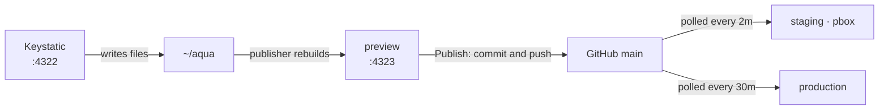

# aqua-cms

Where Aqua Narrowboats staff edit their website.

| | |
|---|---|
| Stack | `~/code/bbox-containers/aqua-cms` → `~/containers/aqua-cms` |
| Image | `aqua-editor:local`, built from the aqua checkout's Dockerfile |
| Ports | `127.0.0.1:4322` Keystatic, `127.0.0.1:4323` preview and Publish |
| Behind | [[caddy]] on this guest, at `aqua-cms.` and `aqua-preview.` |
| Data | The aqua checkout at `AQUA_DIR`, which is also the working copy |
| Secrets | `AQUA_DIR`, `HOST_UID`, `LIVE_URL`, `SSH_DIR` |

## The unusual part

Every other stack here is an image plus a data directory. These three
bind-mount a **git checkout that they also build from**. Keystatic writes
content and photos into it, the publisher runs `astro build` over it, and
Publish commits those files and pushes them to GitHub.

So `AQUA_DIR` is a working copy, not data, and it has to be set up before the
stack starts:

```bash
git clone git@github.com:sam-hudson02/aqua.git ~/aqua
cd ~/aqua && git checkout main
npm ci                 # the containers use this, not the image's node_modules
npm run build          # dist/ must exist before preview starts
```

That checkout needs a deploy key with **write** access. Check it as the user
that owns it before anyone tries to publish:

```bash
git -C ~/aqua push --dry-run origin main
```

## How a change reaches the public



Nothing here serves the public site. Editing and publishing are separate steps
on purpose: a save shows on preview only, and only Publish sends it out.

## Why there is no database

The enquiry forms need Postgres, and the live site has one. Preview serves the
built pages with nothing behind them, so submitting a form on preview gets a
404. That is expected; forms are checked on staging.

## Gotchas

- **`npm ci` in the checkout is not optional.** The containers take its
  `node_modules` rather than the image's, and start and immediately fail
  without it.
- **`HOST_UID` and `HOST_GID` must own the checkout.** Unset, the containers
  run as root and write root-owned git objects into it, after which that user
  cannot commit at all. Recover with
  `docker run --rm -v ~/aqua:/r alpine chown -R 1000:1000 /r`.
- Only one person should edit at a time. They share one working copy, so the
  last save wins, and whoever presses Publish sends everyone's changes.
- `publisher` serves nothing, so it has no healthcheck and shows as plain `Up`.
- An Astro build re-encodes image variants and sharp is not frugal with memory,
  which is what `mem_limit: 3g` on the publisher is for.

## Checks

```bash
curl -s localhost:4322/keystatic -o /dev/null -w '%{http_code}\n'   # 200
curl -s localhost:4323/publish   -o /dev/null -w '%{http_code}\n'   # 200
docker logs --tail 20 aqua-publisher                                 # "preview updated in Ns"
```
